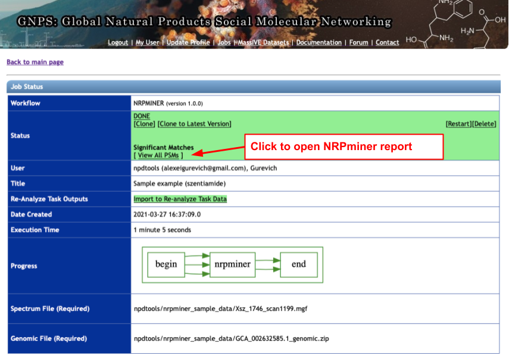

# NRPminer 1.0: Scalable Metabologenomics Algorithm for Non-Ribosomal Peptide Discovery 

## About NRPs and NRPminer

Non-Ribosomal Peptides (NRPs) represent a biomedically important class of natural products that include a multitude of antibiotics and other clinically used drugs. 
NRPs are not directly encoded in the genome but are instead produced by metabolic pathways encoded by biosynthetic gene clusters (BGCs). 
Since the existing genome mining tools predict many putative NRPs synthesized by a given BGC, it remains unclear which of these putative NRPs are correct and how to identify post-assembly modifications of amino acids in these NRPs in a blind mode, without knowing which modifications exist in the sample. 

To address this challenge, we developed NRPminer, a modification-tolerant tool for NRP discovery from large (meta)genomic and mass spectrometry (metabolomics) datasets. Our results shows that NRPminer is able to identify many NRPs from different environments, 
including completely novel NRP families. 

## NRPminer pipeline

NRPminer pipeline. NRPminer steps invovles (a) Predicting NRPS BGCs using [antiSMASH](https://antismash.secondarymetabolites.org/). 
Each ORF is represented by an arrow, and each A-domain is represented by a square, 
(b) predicting putative amino acids for each NRP residue using [NRPSpredictor2](https://www.ncbi.nlm.nih.gov/pmc/articles/PMC3125756/), 
colored circles represents different amino acids (AAs), 
(c) generating multiple assembly lines by considering various combinations of ORFs 
and generating all putative core NRPs for each assembly line in the identified BGC 
(for brevity only assembly lines generated by deleting a single NRPS unit are shown; 
in practice, NRPminer considers loss of up to two NRPS units, 
as well as single and double duplication of each NRPS unit), 
(d) filtering the core NRPs based on their specificity scores, 
(e) identifying domains corresponding to known modifications and incorporating them 
in the selected core NRPs (modified amino acids are represented by purple squares), 
(f) generating linear, cyclic and branch-cyclic backbone structures for each core NRP,
(g) generating a set of high-scoring PSMs using modification-tolerant search 
([VarQuest](http://cab.spbu.ru/software/varquest)) of spectra 
against the database of the constructed putative NRP structures. 
NRPminer considers all possible mature NRPs with up to one PAM (shown as hexagons) 
in each NRP structure. For brevity some of the structures are not shown. 
(h) computing statistical significance of PSMs and reporting the significant PSMs, 
and (i) expanding the set of identified spectra using spectral networks. 
Nodes in the spectral network represent spectra and edges connect “similar” spectra.

## How to run NRPminer

NRPminer is freely available online as a [GNPS](https://gnps.ucsd.edu/) workflow. To run it, you will need to [login to GNPS](https://gnps.ucsd.edu/ProteoSAFe/user/login.jsp) with an existing account or [register a new one](https://gnps.ucsd.edu/ProteoSAFe/user/register.jsp) (it is free, easy and fast).

### Input data
* Centroided spectrum file in MGF, mzXML, or mzML format
* Genome sequence in FASTA or GBK format

The genome sequence should further be preprocessed with the [antiSMASH](https://docs.antismash.secondarymetabolites.org/) pipeline to reveal tentative NRP BGCs. We recommend using the [online version](https://antismash.secondarymetabolites.org/) of antiSMASH with the default settings. The command-line version of antiSMASH v.5 works as well. The actual NRPminer input would be a zip archive with antiSMASH results (use "Download" -> "Download all results" menu to get it from the web version).

Feel free to try NRPminer with our [sample data](https://github.com/mohimanilab/NRPminer/tree/main/test_data). This genome and spectrum correspond to szentiamide peptide from *Xenorhabdus szentirmaii* DSM 16338 (see [Ohlendorf et al, 2011](https://journals.sagepub.com/doi/pdf/10.1177/1934578X1100600909) for more detail on this NRP). The spectrum file is from the [MSV000081063](https://gnps.ucsd.edu/ProteoSAFe/result.jsp?task=dcc30b777c344d668a5626d01f26c9a0&view=advanced_view) dataset.

### Step 1
Open a browser, go to GNPS ([https://gnps.ucsd.edu/](https://gnps.ucsd.edu/)) and login.

### Step 2
Go to the NRPminer workflow using this direct link: [https://gnps.ucsd.edu/ProteoSAFe/index.jsp?params=%7B%22workflow%22:%22NRPMINER%22%7D](https://gnps.ucsd.edu/ProteoSAFe/index.jsp?params=%7B%22workflow%22:%22NRPMINER%22%7D) (you will be reidirected to the main GNPS page if you are not logged in, i.e. if you skip Step 1)

### Step 3
Select input files (spectrum and genomic data).

#### Step 3.1
Add spectra to user directory either by uploading them or importing from an existing MassIVE dataset.

#### Step 3.2
Select the spectrum file of interest from user directory.

#### Step 3.3
Repeat the same with the genomic file and finish the selection process. Note that there is no genomic files in MassIVE datasets, so you can only upload it from your local computer.

### Step 4
Set up parameters in the NRPminer workflow. Hover over control elements to reveal tooltips.

### Step 5
Submit job and check email for notifications.

### Viewing results

### Step 1
If the job finishes correctly, its status becomes "Done". To open NRPminer report with discovered NRPs, click on the "View All PSMs" link in the status pane. Feel free to check results of [our sample job](https://gnps.ucsd.edu/ProteoSAFe/status.jsp?task=6ad7a36c0ef84398b4d3854fced078ae) on the szentiamide data.

### Step 2
The NRPminer report is a filterable table that includes information on exact spectra scan and genomic location corresponding to each discovered NRP. The report column names are self-explanatory. Note that only hits with P-values below user-defined thresholds are reported (default value is 1.0e-20).

## Feedback
If you have any questions regarding NRPminer or wish to report a bug, please write to [Hosein Mohimani](mailto:hoseinm@andrew.cmu.edu) or [Bahar Behsaz](mailto:bbehsaz@andrew.cmu.edu).
For issues with the GNPS workflow, please contact [Alexey Gurevich](mailto:alexey.gurevich@helmholtz-hips.de). In either case, feel free to [post a GitHub issue](https://github.com/mohimanilab/NRPminer/issues).

